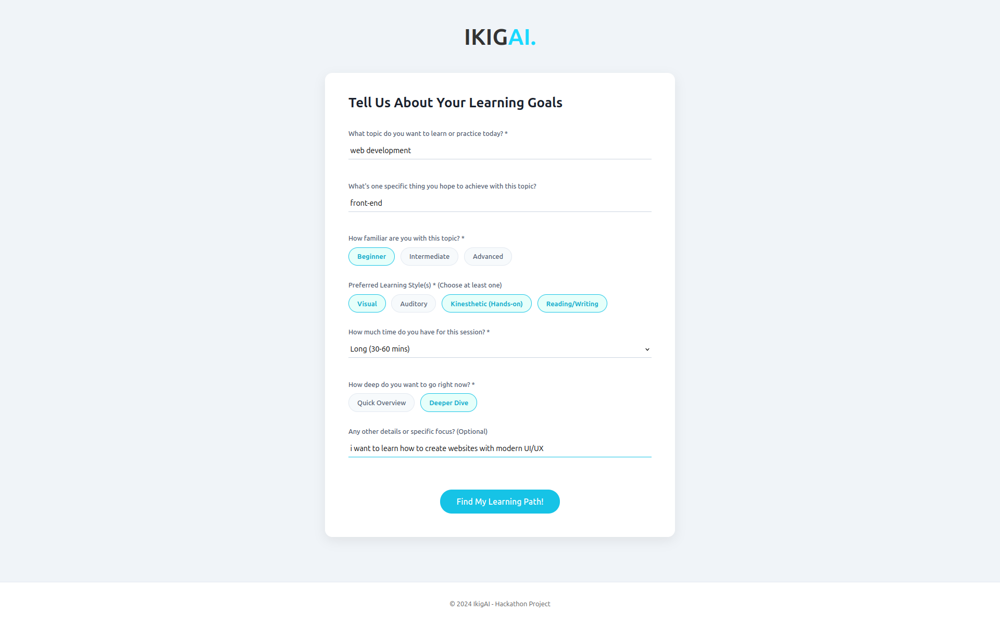
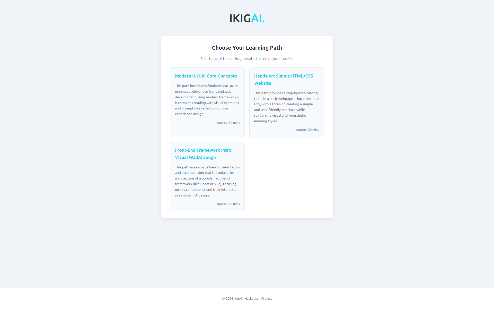
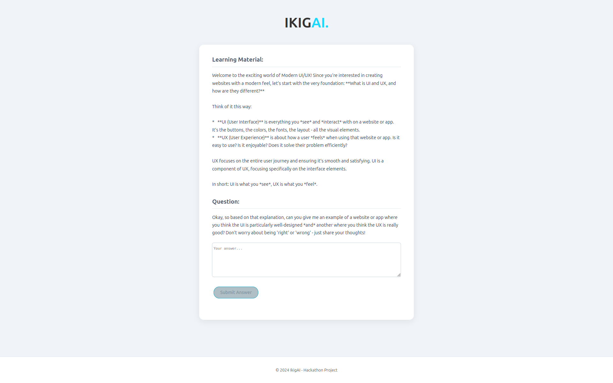
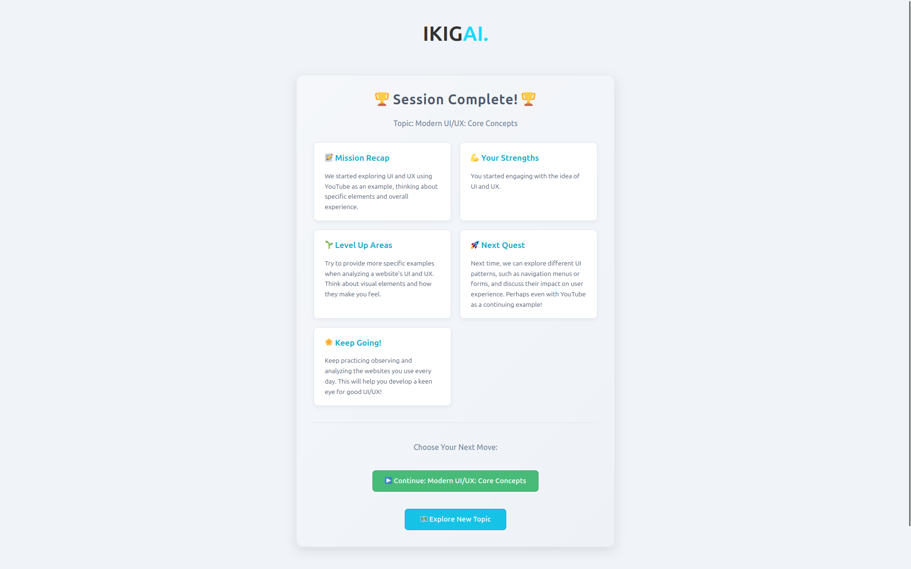

# IKIGAI


## 🚀 Project Overview

Your Best Personal AI-Tutor

Demo on Youtube: https://youtu.be/pAvr42p8x9k

## ✨ Features

- Choose ANY Topic you want to learn.
- Choose style and temp.
- Get practical feedback and use in real life.
- Continue learning session any time you want.

## 🛠️ Technologies Used

Frontend - React
Backend - Python(flask)

## 📋 Prerequisites

- python 3.10

## 🖼 Screenshots






## 🔧 Installation

! **DO NOT FORGET TO GET GEMINI API KEY FROM https://ai.dev**

```bash
# Clone the repository
git clone https://github.com/your-username/ikigai.git

# Navigate to the project directory
cd gdg-edtech-hackathon

# run frontend

cd frontend

npm install

npm start

cd ..

# run backend

cd backend

pip install -r requirements.txt

python app.py
```

## 👥 Team

- David Zoidze
- Ani + Nini Merabishvili
- Iakob Zaqarishvili
